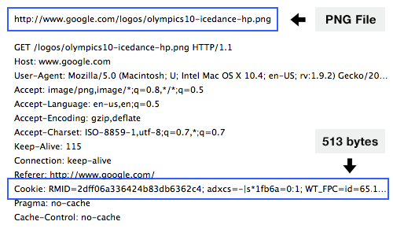
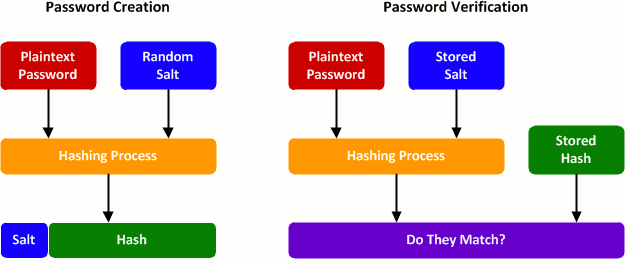

# Authorization

## Summary
In this challenge you will be learning about how to authenticate users and authorize which areas of your site they get access to - a crucial part of every modern web application.

You will do that by creating cookies to send to the browser and sessions to verify the cookies. After that you will be encrypting your stored passwords with bcrypt in order to keep your user information secure.

### Learning Goals
- [ ] Understand the basics of cookies and sessions
- [ ] Understand the purpose of different encryption methods and how they work
- [ ] Understand how headers play a role in authorization
- [ ] Gain exposure to server side templating
- [ ] Understand the pros and cons of different session storage methods

### Cookies


A cookie is a small amount of data that is stored in the browser. When a cookie is set in the browser, it is then automatically sent by the browser with every request to the server. That means the server can 'remember' the user's previous activity by inspecting the information stored in the cookie. Cookies allow websites to maintain state - that is, to persist information even as the page reloads. We'll use them here for maintaining a user's credentials.

### Sessions
Sessions are used to validate whether a user (with the proper cookies) should be logged into their account. A user receives a cookie when they successfully login to their account. Whenever the user visits the site again, the server verifies the user's cookie, uses that information to determine if the user has a session, and then can redirect the request appropriately (either to a login page if they're not logged in or to the requested resource if they are logged in).

### Bcrypt
It is not safe to assume that your data is impenetrable (by hackers, curious and/or disgruntled employees). Therefore it is essential not to store passwords (and other sensitive data) in plain text. If somebody gains access to your data, not only will they be able to login to your account for your site, but consumers also generally use the same password for many sites, and therefore the attacker will have access to those accounts as well. A standard way to ensure that information is not readily readable is by encrypting the data:


Typically in encryption, a special key is used to encrypt and decrypt the information. However, because the same key is used to encrypt and decrypt, an attacker who gains access to the key (or guesses it) will be able to decrypt all the passwords. Therefore when we store sensitive information on the server, a one-way encryption (cryptographic hash function) is used. This means that we can verify if a user's entered password is correct by passing it through our one-way encryption function and comparing it to the encrypted version on the server. Additionally, there is no way for us to obtain the user's real password from the encrypted version on the server.


Now if an attacker was to gain access to your database they would just have a list of one-way encrypted passwords. We've improved our security, but it's still not enough. Attackers often utilize a list of the most common passwords, hash them with multiple hashing functions, and then compare their results to values in the database. If the attacker finds a match, they now know your cryptographic hash function. At this point the attacker can apply the same hash function to their list of common passwords and look for matches in your database. This is known as a **dictionary attack**. The attacker may also perform a **brute force** attack, simply trying to hash every combination of passwords up to a given length and then comparing the resulting hash to a hash (or many hashes) in your database.

A way to speed up password cracking is to precompute the hashes of many passwords and store them in a table. Then the attacker can quickly run through their table of precomputed hashes and compare them to those in your database. This is known as a **lookup table**. A **rainbow table** is a type of lookup table that has been optimized to store **more** known hashes in the same amount of space, which results in it being more effective at finding passwords but slower to run.



Bcrypt was developed to reduce the effectiveness of rainbow tables. Before a user's password is encrypted a random string (known as a salt) is appended to the password. The string that is encrypted is no longer a common password since there is a random string of characters following it. In order for salting to be effective, a **random** salt must be used for every password - if the same salt was used for every password then a new lookup table could be created with the same salt appended to each password, making the salt pointless. Now when a user attempts to login, Bcrypt needs to know the specific salt that was used to encrypt their password so that it can hash the password + salt. Bcrypt achieves this by simply storing the salt in plain text along with the hashed password in the database. Storing the salt in plain text might seem like a security flaw, but remember that the point of a salt isn't to be secret, it's simply to make rainbow tables ineffective and reduce the effectiveness of brute force attacks somewhat.

[How to hash + salt the right way](https://crackstation.net/hashing-security.htm)


## Getting started

### Setup
- [ ] Run `npm install` to install server-side dependencies
- [ ] The challenges and tests for this unit require a local MongoDB instance to be running. You should already have MongoDB installed from the database unit. Here are instructions to start a local instance:
  * Mac (installed via Homebrew): `brew services start mongodb-community` or see [here](https://docs.mongodb.com/manual/tutorial/install-mongodb-on-os-x/#run-mongodb)
  * Ubuntu Linux: `sudo service mongodb start` or see [here](https://docs.mongodb.com/manual/tutorial/install-mongodb-on-ubuntu/#run-mongodb-community-edition)
  * Windows: It should already be running if installed as Windows service. See [here](https://docs.mongodb.com/manual/tutorial/install-mongodb-on-windows/#run-mdb-edition-as-a-windows-service)
  * To check whether you have a running MongoDB instance, type `mongo` in the terminal to launch the MongoDB Shell connecting to the database on 127.0.0.1(localhost):27017, which is also a good way to see what data you have in the database and also modify them. Checkout the docs for commands you can use [here](https://docs.mongodb.com/manual/mongo/#working-with-the-mongo-shell)
- [ ] Run `npm start` (in a separate terminal tab or window if you have `mongo` running already) to start your server. Open your browser and head to `http://localhost:3000/`

### Testing
- [ ] Run `npm test` in your terminal to test your code
- [ ] Additionally, you should be constantly testing out your code in the browser to assess its functionality.

## Challenges

### Creating users
- [x] Add route to handle POST requests to `/signup`
- [ ] Modify the `userController.createUser` middleware in the `./server/controllers/userController.js` file to create a user from the client's request. Users require the following properties:
```
{
  username: [String]
  password: [String]
}
```
- [ ] If the POST request is successful, redirect to the `/secret` route
- [ ] If the POST request is unsuccessful (i.e. your attempt to add a user to the database fails for some reason), invoke the global error handler.
- [ ] Add a route that handles POST requests to `/login`
- [ ] Modify the `userController.verifyUser` middleware in the `./server/controllers/userController.js` file to check if a user exists and the password is correct
- [ ] If the username cannot be found or the password is incorrect, they should be redirected to `/signup`

### Create a cookie
- [ ] Inside of the `cookieController.setCookie` middleware, create a cookie named 'codesmith' with the value of 'hi' and attach it to express's response
- [ ] Insert the `cookieController.setCookie` middleware into the `/` route so that requests to `/` have the `codesmith` cookie sent with the response
- [ ] Verify in Chrome that the `codesmith` cookie is being sent by starting your server and navigating to `localhost:3000/`. Open up the Chrome dev tools, go to the `Application` tab, and find the `codesmith` cookie in the Cookies section.
- [ ] Inside of `cookieController.setCookie` middleware, create a cookie named 'secret' with a value that is a random number generated from 0-99 that should be sent to the server with all requests
- [ ] Inside of `cookieController.setSSIDCookie`, create a cookie named 'ssid' with a value that is equal to the id of the user (mongoose creates an id for each user - you will need to implement a method to get the id of the user)
- [ ] After a user successfully signs up or logs in, call the `cookieController.setSSIDCookie` function to add the `ssid` cookie to the response.
- [ ] Follow best practices by making the `ssid` cookie HttpOnly. This means that client-side JavaScript cannot access your cookie, which greatly decreases the likelihood of it being stolen or manipulated by malicious JavaScript running on the client.
  - [Why use HttpOnly?](http://scottksmith.com/blog/2014/09/04/simple-steps-to-secure-your-express-node-application/)

### Sessions
- [ ] Create a session when a user creates an account. For now, each session will simply be a document in a Mongo database. A session has the following properties:
```
cookieId: [String]
```
The cookieId is equal the to the value of the cookie named `ssid` (which is equal to the user's id).
- [ ] Create a session when a user logs in to an account

### Blocking certain pages
- [ ] Modify the `sessionController.isLoggedIn` middleware to verify if a user has a cookie with the name "ssid" and it has an active session. If they do, they should be able to access the following page:
```
http://localhost:3000/secret
```
- [ ] If they do not, they should be redirected to the signup page
```
http://localhost:3000/signup
```
  - Hint: Express doesn't parse cookies from the HTTP request by default. You'll need to add in that functionality somehow. Typically with express when we need to add in extra functionality, we do it with middleware.

- [ ] In `server/server.js`, modify the `/secret` express route so that the `sessionController.isLoggedIn` middleware verifies the session BEFORE allowing the secret page to be rendered.

- [ ] You'll see in `client/scripts/secret.js` that upon loading the secret page, your browser will make a `fetch` request to the endpoint `/secret/users`. In our `server.js` file, this endpoint is set up to invoke the `userController.getAllUsers` middleware and send all users and their passwords back to the client. Currently, there's nothing in our application that directs us to this endpoint without first going through the protected `/secret` route. But what if an unverified hacker tried sending a request to this endpoint *without* going through our UI? You'll want to make sure that this isn't possible - remember, all protected routes should implement authorization!

### Bcrypting passwords
We are going to add a hook that will run before any passwords are saved that will bcrypt passwords before they are saved.
- [ ] Have it so that when a new user is created their password is then bcrypted before being saved to the database.
  - Hint: To do this the right way, check out [Mongoose Middleware](http://mongoosejs.com/docs/middleware.html)
- [ ] When a user signs in, implement a method to compare their inputted password to the hashed password in the database

### Extension
**Note:** There are no tests in place for these challenges at this time. Read through them and choose the one that seems most interesting. You will likely not have enough time to do more than one, so we highly recommend starting with either the OAuth or JWT challenges!

- [ ] Use a JSON Web Token stored inside our `ssid` cookie as your session store
  - Again, you'll probably want to make a new branch off of your master before starting this section.
  - A [JWT](https://jwt.io/), or JSON Web Token, is a standard for storing signed, verifiable information that cannot be modified by the client
  - An advantage of using a JWT for our session store is that our server has everything it needs to know about the session right inside the JWT - it doesn't need to perform further lookup in a database. What downsides do you think there are to this method of session store?
  - Be sure to keep your JWT secure by following [best practices](https://stormpath.com/blog/jwt-the-right-way/)
  - To create your JWT, you'll want to use an npm module such as [node-jsonwebtoken](https://github.com/auth0/node-jsonwebtoken)
- [ ] Implement [CSRF](https://github.com/pillarjs/understanding-csrf) security for our forms so that our sessions can't be hijacked by Cross-Site Request Forgery attacks
  - As is typical with express, bringing in a [CSRF middleware](https://github.com/expressjs/csurf) gives us the functionality we need for this type of security.
- [ ] Implement an OAuth login flow so that the user can sign in with their [GitHub account](https://developer.github.com/v3/oauth/#web-application-flow).
  - You'll need to register with GitHub to acquire a `client_id` and specify the OAuth `redirect_uri` for your application
  - You'll also need to add a button to your `/login` page that sends the client to `https://github.com/login/oauth/authorize` with your client_id and redirect_uri included as `urlencoded` parameters. The href for the link will end up looking something like this: `https://github.com/login/oauth/authorize?client_id=123456&redirect_uri=http://localhost:3000/your_registered_redirect_route`
  - Once the client goes to that page and logs in with their GitHub information, GitHub will send them back to your redirect url and include a temporary `code` in the url as a url encoded parameter. You'll need a route to handle that request, retrieve the code from the url, POST it back to GitHub, and finally receive the user's **token** in GitHub's response to your POST.
  - Once you acquire a token for the user, store it using the session store of your choice (Mongo session, local session, Redis session, JWT session, etc...)
  - Allow the user to view some information from their GitHub profile by navigating to the `/profile` route.
    - Hint: you'll need to use their **token** to make an authenticated request to the appropriate [GitHub API](https://developer.github.com/v3/users/#get-the-authenticated-user) route
- [ ] Use [passport](http://passportjs.org/) to create a local session when a user signs up or logs in
  - Commit your work and make a new branch before implementing Passport, since it will require heavy modification to your route middleware.
  - Be sure to understand how a passport local session works. "local session" here means that the session will be stored in memory, no longer kept in our Mongo database. Why might this type of session store be advantagous? What are we giving up by doing this?
- [ ] Setup [Redis](http://redis.io/) as your session store
  - Since this will require heavy refactoring, you'll likely want to make a new branch before implementing this section
  - Install Redis locally following their [quickstart](http://redis.io/topics/quickstart) guide
  - Take some time to glean some information from the following articles. Try to understand the use cases for Redis and why session store might be a good use for it. What are the trade-offs of using Redis vs Mongo for a session store?
    - [How to take advantage of Redis](http://oldblog.antirez.com/post/take-advantage-of-redis-adding-it-to-your-stack.html)
    - [Redis tutorial + use cases](https://web.archive.org/web/20120118030804/http://simonwillison.net/static/2010/redis-tutorial/)
  - Start your redis server with the `redis-server` command in a separate command-line window
  - You'll want to use the [node_redis](https://github.com/NodeRedis/node_redis) library for interacting with Redis
- [ ] Finally, give the user a `logout` button that deletes their session information
  - The `logout` button should only be visible when the user is logged in


## Resources and links
- [http://kestas.kuliukas.com/RainbowTables/](http://kestas.kuliukas.com/RainbowTables/)
- [https://www.nczonline.net/blog/2009/05/05/http-cookies-explained/](https://www.nczonline.net/blog/2009/05/05/http-cookies-explained/)
- [Hash and salt passwords properly](https://crackstation.net/hashing-security.htm)
